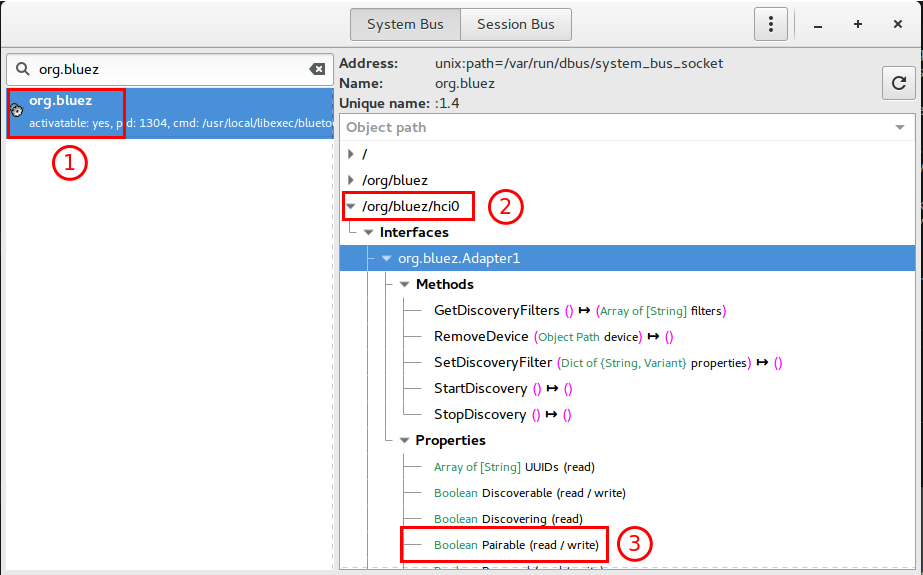

# Basics

* Got the basic console app created and it can build.
* Added DBus library.
* Now need to figure out how to do stuff...

```console
me@machine:~/code/dotnetdbus/netmon$ dotnet dbus list services --bus system
com.redhat.NewPrinterNotification
com.redhat.PrinterDriversInstaller
...
fi.w1.wpa_supplicant1
org.bluez      <----------- GOOD!
...
org.freedesktop.thermald
org.freedesktop.UDisks2
org.freedesktop.UPower
org.gnome.DisplayManager
```
Create the D-Bus objects
```console
me@machine: dodgyrabbit.MidiBle$ dotnet dbus codegen --bus system --service org.bluez
Generated: src/dodgyrabbit.MidiBle/bluez.DBus.cs
```

## What useful objects do we see?

```console
me@machine: src/dodgyrabbit.MidiBle$ dotnet dbus list objects --bus system --service org.bluez
/ : org.freedesktop.DBus.ObjectManager
/org/bluez : org.bluez.AgentManager1 org.bluez.ProfileManager1
/org/bluez/hci0 : org.bluez.Adapter1 org.bluez.GattManager1 org.bluez.LEAdvertisingManager1 org.bluez.Media1 org.bluez.NetworkServer1
/org/bluez/hci0/dev_65_3D_FA_DE_2F_B3 : org.bluez.Device1
/org/bluez/hci0/dev_67_49_10_09_B7_A0 : org.bluez.Device1
/org/bluez/hci0/dev_6E_BD_4D_C2_CC_94 : org.bluez.Device1
/org/bluez/hci0/dev_77_A9_45_16_57_1A : org.bluez.Device1
/org/bluez/hci0/dev_7A_73_C4_42_58_09 : org.bluez.Device1
/org/bluez/hci0/dev_A0_6F_AA_3A_76_57 : org.bluez.Device1
```

I guess **org.bluez.GattManager1** looks interesting... (tries to do stuff with it)
then again maybe not.

# Major lightbulb moment

Messing around with this stuff, you get confronted with weird errors, like

```console
IDI to BLE Bridge
Connecting to System D-Bus...
Connected
Setting power to true on device 1

Unhandled Exception: System.AggregateException: One or more errors occurred. (org.freedesktop.DBus.Error.ServiceUnknown: The name org.bluez.Adapter1 was not provided by any .service files) ---> Tmds.DBus.DBusException: org.freedesktop.DBus.Error.ServiceUnknown: The name org.bluez.Adapter1 was not provided by any .service files
   at Tmds.DBus.DBusConnection.CallMethodAsync(Message msg, Boolean checkConnected, Boolean checkReplyType)
   at Tmds.DBus.Connection.CallMethodAsync(Message message)
   at Tmds.DBus.CodeGen.DBusObjectProxy.SendMethodReturnReaderAsync(String iface, String member, Nullable`1 inSignature, MessageWriter writer)
   at dodgyrabbit.MidiBle.Program.<>c.<<Main>b__0_0>d.MoveNext() in /home/pieterventer/code/midi-ble-bridge/src/dodgyrabbit.MidiBle/Program.cs:line 28
   --- End of inner exception stack trace ---
   at System.Threading.Tasks.Task.Wait(Int32 millisecondsTimeout, CancellationToken cancellationToken)   at System.Threading.Tasks.Task.Wait()
   at dodgyrabbit.MidiBle.Program.Main(String[] args) in /home/pieterventer/code/midi-ble-bridge/src/dodgyrabbit.MidiBle/Program.cs:line 13
```

The main problem is that I'm not very familiar with D-Bus and I'm confusing **services** and **objects** and the way you address them. This how I discovered my mistake.

There is a useful tool called d-feet that allows you to navigate the D-Bus hierarchy. I decided to review that against my code.


1. The **service identifier** is `org.bluez`. I thought there will be "different" ones for various parts of BlueZ, but it seems this is all I'm going to need.
2. The **object identifier** is `/org/blue/hci0`. Notice the differences here. The service has dots between and the object paths have forward slashes. Note that you must start with a `/` otherwise you'll get an `ArgumentException` during the validation. That took me a minute or two to realize.
3. The **properties** are exposed via the Interface that was automatically created by `dotnet dbus codegen` command earlier.

Now I feel where getting somewhere!

## Not for too long!

OK so I hit another snag...

I can't seem to locate the 'org.bluez.LEAdvertisement1' interface and it should be there.
https://stackoverflow.com/a/41398903

Some kind of voodoo going on here.
I tried to make sure that the --experimental was turned on, that took a whole different detour.
https://learn.adafruit.com/install-bluez-on-the-raspberry-pi/installation#enable-bluetooth-low-energy-features

But I swear it was working with the python examples. How could that be???

Either that Interface is not advertised (but it works) OR python code is not using the same bluetoothd??
Let me run it again and see.

## Breakthrough?

The reason the interface is not being returned... looking in the BlueZ source I found this:
https://git.kernel.org/pub/scm/bluetooth/bluez.git/commit/?id=933a25965a03bcf8e83c39a60523c608fa9c6bd9

What is this? Some kind of config file that denies it.
This turned out to be a dead-end. 
It seems this particular object that it needs - is not published as an Interface.