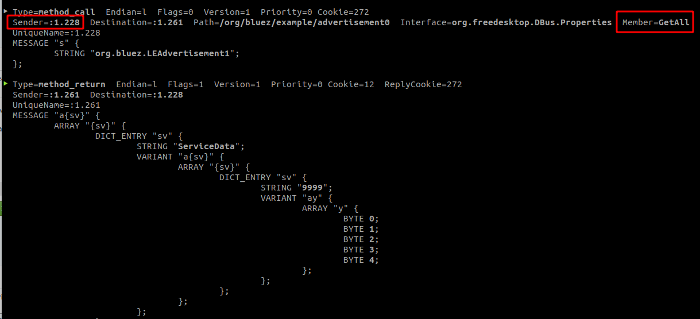
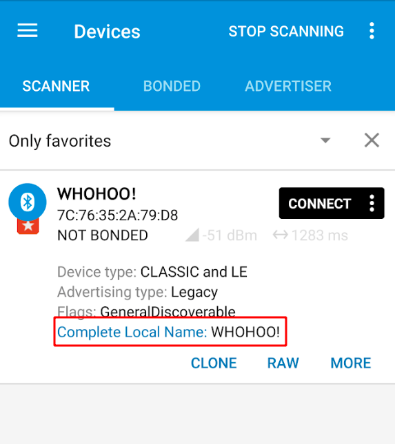

# Riding DBus
I was hoping that this stuff is really abstracted away, but I guess you need to know a bit more of what's going on.

## Sending an object
Here's what I'm trying to do:

Call `RegisterAdvertisement(Object Path advertisement, Dict of {String, Variant} options)` on `/org/blues/hci0`

Now I've tried various things, including creating dictionaries, classes etc.
Nothing worked!

I have somewhat limited understanding of Python, but looking at the code and tracing the messages with 
`sudo busctl monitor org.bluez` I noticed this:


The interesting thing here is that :1.128 is not me. BlueZ is calling **me** asking for GetAll.

So this is what I'm concluding:
* When you pass an object path to a method, you should expect to be called back.
* When the time is right and they call you, return the properties asked for.

After some more tinkering, it's finally working.
I hit one snag along the way and got a nasty error. I had a typo in "perhiperhal" but here we go:



# Serialization

It seems that the way objects are serialized for DBus works as follows:
* `private` **fields** are serialized
* `public` **properties** are ignored
* `_` underscores are ignored
* `null` field values are ignored
* It is case sensitive

This means you can't use [auto properties](https://docs.microsoft.com/en-us/dotnet/csharp/programming-guide/classes-and-structs/auto-implemented-properties) since you don't have control over the backing member.

For example:
```csharp
class Customer
{
    public string Name { get; set}; 
}
```

May result in a key value of **<Name>k__BackingField**, which is probably not what you wanted.

```JSON
DICT_ENTRY "sv" {
    STRING "<Name>k__BackingField";
        VARIANT "s" {
            STRING "Joe Soap";
        };
    };
};
```